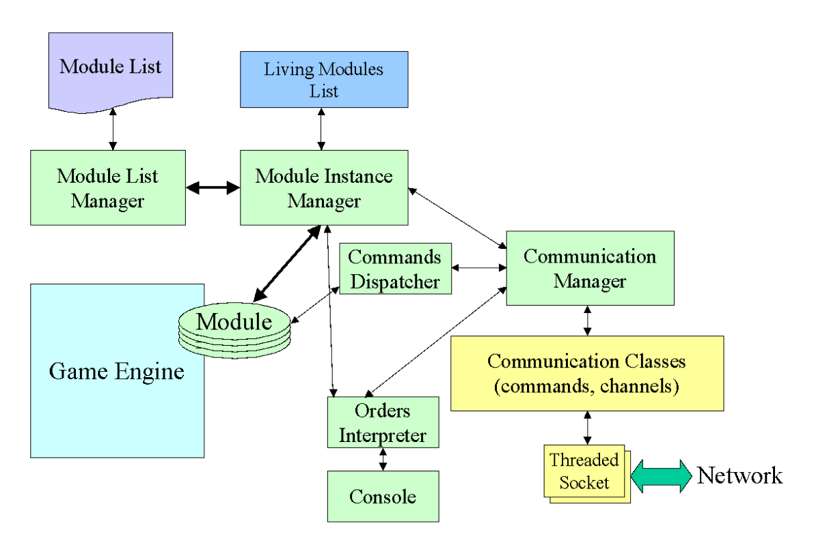
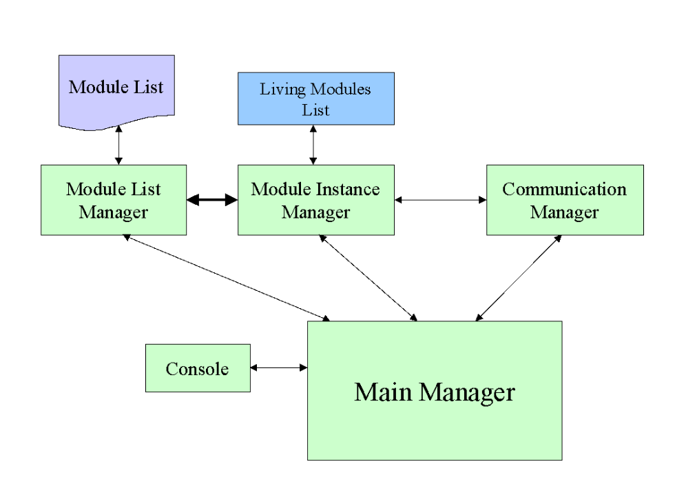

# HLM
The High Level Manager (HLM), is a distributed system written in Java, with a client in C++, based on plain java remote object (with a limited set of types) that can be called directly by their name. It makes it extremely fast to set-up and use, so great for quick prototyping and tutorials or demonstrations.

It was used as part of the IPerG EU project, and we used it to successfully demonstrate a 3D/2D persistant multiplayer game, with 3D C++ clients and 2D mobile clients. The mobile clients were not directly connected to the main HLM, but to their server that uses a local HLM to communicate to the central one.
As the prototype was not extended afterward, the HLM was not updated much. It was used for an art exhibition, called See me, and a Student prototype.

As so, it is highly unsecure, the connections are always connected (i.e. all clients need to stay connected to their socket) and there are probably many other things to change or update to go toward something usable for serious applications. So if you do so, it is at your own risk.

# Concept

The principal idea is to give a uniform, simple to use and simple to remember way to be used by and to use other elements. To achieve this simplicity, we have defined a module:
- one module usually is always instantiated. You can call a module anyway, and you call always the same module. You manage multiple instances only if you want to.
- one module is directly usable locally or distantly, without the need of a stub,
- one module manipulates only simple types, integer, char or string,
- the description of the module is clearly written in a text file, both for the system and for the user,
- one module can be added/removed (including instantiation) and updated (switching between instantiation with recovery of data) during runtime,
- facilities are furnished to help you manage more advanced tasks.
And the implementation of one module follows simple rules, which allows it to not be limited by this simplicity:
- the module must be in a special repository,
- the class implementing the module can have objects and methods not part of the module,
- the constructor is not part of the module,
- any advance mechanism might no be in one module but accessible via one module.
Then, we use the high-level characteristic of the used language to offer both this simplicity and these functionalities. Even if we use Java, this solution was designed to be cross-platform and language and might be extended to other languages. The main functionality needed is the introspection: the modules are described, retrieved, ran and used using the introspection. Then, the global architecture is composed of different managers, forming themselves a high-level manager.

# The “HIGH-LEVEL MANAGER”

The schema bellow shows an extensive view, even if not exhaustive, of the generic module support, the high-level manager. 

The module list manager simply adds/extracts the module descriptions of the modules to/from the description file. The Module Instance Manager is the most important manager and allows the instantiation and the use of the modules. The communication manager handles the distant connection using threaded sockets (both server and client). In the current implementation, only the command communication is working, as it is the main and only mandatory communication, allowing using distant modules. The channels are important (they are virtual “direct link” of data between modules), as they are more suited to important flux of data, and should be developed for the next version of this architecture. They have been already designed properly, but the implemented solution is not usable and need to be fixed.
The Commands Dispatcher, as the name show, serves at dispatching one command to a distant module, and receives the result.
The order interpreter is a simple facility to traduce a command line in a module method call. It is used by the console to directly call the module’s methods, and by the communication manager to decode the distant call (this solution was chosen as a shortcut and should disappear in the next version, replaced by a proper network abstraction).

And one main class, the main manager, starts and manages all the others managers (the order interpreter is a simple facility and has not to be started systematically):

This solution, even if the schema seems complex, is fairly simple, as all the elements presented can be lightweight, using high-level languages like Java. The module is the most important part of this solution, and is then presented in the next paragraph.

# The Modules

One module is a simple closed tool, accessible via interface. A module is actually a classical piece of software, written in the supportive language, which gives a public interface to be used as a module. The way the module is written is not constrained, but the given interface must follow strong constraints. 
A module is defined by:
Its name, its methods list: One method is defined by its name, its parameters types and its return type.
The allowed types are: string, char, int, long, float, double, and void.

For example, a module can be represented like that:
 
Module:mmrolink.JustForTest: Java
Methods:
Method:myMethod::string:int. return:int. endofmethod. 
Method:myOtherMethod::noparameters. return:string. endofmethod. 
No more methods.

This description is specifically conceived to correspond to a small common subset of most of the programming languages, to allow us to give an abstract way to use them. To illustrate better what is a module and how we define it, we can give an example, where we incorporate the following Java class into the module base:
package modulerepository;

public class DummyClass
{
// The method we want to use for the module
      public int dummyEntry(String oneParameter)
     {
        ...
     }
// Others methods (hidden for the module)
      public int dummyMethod1 ( ... )
        ...
}
To add the methods to communicate, we define them in an interface. The usable types are the only ones defined for one module, and these methods have to take care of the allowed limits, as they can be of a type that differs from the supporting language to the module types. The numerical types are conceived to correspond to the possibilities of most languages, i.e. they implements the smallest common limits. This interface should look like the following:
package modulerepository;

public interface DummyPublicInterface
{
    public int dummyEntry(String oneParameter);
}
Then we implement this interface into DummyClass. Then, a specific tool, named ExtractInterface, can use the name of the class and of the right interface to write the module description, which is independent to the supporting language:
Module:mmrolink.DummyClass: Java
Methods:
Method:dummyEntry::string. return:int. endofmethod.
No more methods.
A special module, the Super Module (“SModule”) has the special ability to extract the module description from a class and an interface and to start the described module immediately, giving the addModule(“nameOfModule”,”interfaceOfModule”) method. This module must always be started (we envisage to instantiate it without description) and will also be used to remove/change a module.
Following the previous example, you can add the module using the console by typing SModule.addModule(“DummyClass”,”DummyPublicInterface”) then you can use the module’s methods, for example by writing DummyClass.dummyEntry(“One try”).

# Local Module Support

A Module Instance Manager (MIM) mainly does the local support of the modules. This one instantiates the modules and manages their run and their end. At it starts, it asks for the list of local modules to the Module List Manager (MLM), then instantiates one time each module, except if a module is declared to be instantiated only on demand. In this way, the modules are usable like static objects, but the MIM can also create other instances on demand. The next schema illustrates the local elements of this solution.

The Orders Interpreter is a simple facility, which is able to traduce simple text command into a module method call. A typical module method call is on the form: modulename[.instance number (0 by default)].methodname(value, …).

# Networked Module Support

The network support is also designed to be fairly simple but powerful and flexible. It consists in giving an abstraction of a simple client-server communication protocol. Simple sockets, using TCP in a first implementation, support the communications. The protocol is plain text and as simple as possible.
The distant modules are used from a high-level manager by a list of distant element and by the use of a simple tool to create the command text, which is send as it (on the form modulename[.instance number (0 by default)].methodname(value, …) ).
A specific class, ToGetResults, can be used to recover the result from a distant class and has simply to be registered at the call of a distant command. This call is handled by the command dispatcher. 

# One application: The Garden of Earthly Delights

We used this solution to write the game prototype Garden Of Earthly Delight in the WP Massively Multiplayer Reaching Out of the project IPerG (IPerG 2005). This prototype allowed both PC clients and mobile clients to play the same game. The high-level manager was used as the main server, used by the PC client and the Mobile server, which serves as a proxy for the mobile clients. All game-related functions have been implemented into modules, as the game logic, in the module GameManagement. This module offers a clear public interface, as you can see in this extract of the Java interface used for the module description:
public interface IGameManagement
{
    // Player distributed method
    public void createPlayerEntity(String Nick, float x, float y, float z, float dir, int status);

…

    public void contributeToSpell(String creatorId, String playerId, int placeWanted);

    public void cancelSpell(String creatorId, String playerId);

    public void confirmSpell(String creatorId);

    // Drain/Boost action (mobile play only)
    public void mobileSpell(int type, int energy, String creatorId, String targetNick);
}
These methods are synchronised and might be used by both PC and Mobile clients, even if some are specific to a client type. The same module (so the same instance of the class) is used by all the different clients. Classes represent the game entities and the game-play is contained into this module. One specific method, onTick, implemented from a particular interface to use a facility class, Tick, is called regularly by a thread created by the class Tick, and allows to update the monsters and to clean and save the players entities. We will not detail the game logic, as there is no originality in it and it simply tries to follow the game design.
The persistency is actually managed via a module and was developed by Paulo Lopes. It is an elegant solution but it was dedicated to the game due to the limited development time. It should be enhanced and be usable as a part of the solution, but still separate from the core, as it is not mandatory for the system and works very well via a module.

Have participated to this implementation and helped to enhance the software Paulo Lopes, Joakim Olsson, and Johan Simonsson.
